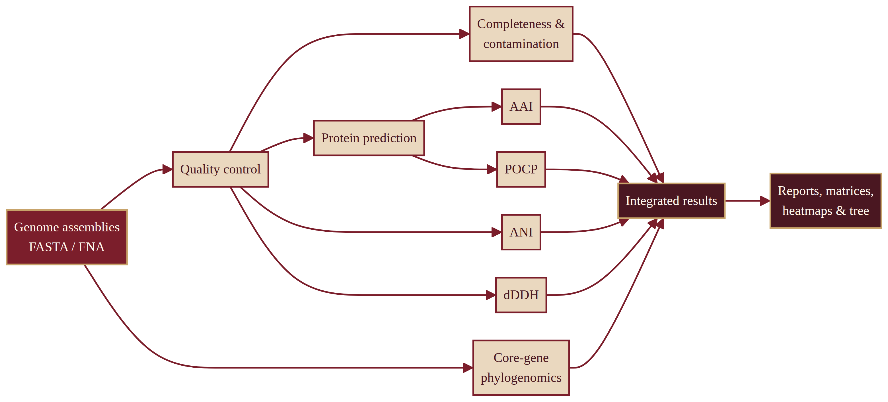

# Genome Taxonomy Pipeline

An integrated bioinformatics pipeline for the genome-based taxonomic characterization of bacteria, combining **ANI**, **dDDH**, **AAI**, **POCP**, and core-gene **phylogenomics** in a single automated run.

Developed during a research internship at the **Institut des Régions Arides (IRA)**, Médenine, Tunisia (Laboratoire de Recherche "Écologie Pastorale").

## What it does

Given a folder of bacterial genome assemblies (FASTA), the pipeline runs nine steps end-to-end — every step is optional, see `--steps` below:

| Step | Task | Tool |
|------|------|------|
| 1 | Quality control (size, GC%, contigs) | custom script |
| 2 | Completeness / contamination (needs step 1) | [CheckM2](https://github.com/chklovski/CheckM2) |
| 3 | Protein prediction | [Prodigal](https://github.com/hyattpd/Prodigal) |
| 4 | Average Nucleotide Identity (species delineation, 95% threshold) | [FastANI](https://github.com/ParBLiSS/FastANI) |
| 5 | digital DNA-DNA Hybridization (species delineation, GBDP formula 2, Auch et al. 2010 method) | custom script + BLASTN |
| 6 | Average Amino acid Identity (genus-level relationships) | [EzAAI](https://github.com/endixk/ezaai) |
| 7 | Percentage of Conserved Proteins (genus delineation, 50% threshold, needs step 3) | custom script + [DIAMOND](https://github.com/bbuchfink/diamond) |
| 8 | Phylogenomic tree (120 bacterial core genes, GTDB bac120 set) | [EasyCGTree4](https://github.com/zdf1987/EasyCGTree4) (Perl) + FastTree |
| 9 | Figures (heatmaps + annotated tree) | R (ggplot2, ggtree) |

A single command runs the full chain:

```bash
python scripts/pipeline.py
```

Run only a subset with `--steps` (comma-separated, e.g. `--steps qc,ani,dddh`) — useful to skip CheckM2 (RAM-heavy, see Requirements) while still getting the rest.

## Architecture

**Python** orchestrates the whole pipeline via `subprocess`, calling out to **Perl** (EasyCGTree, for the phylogenomic tree) and **R** (ggplot2/ggtree, for the figures) — the same multi-language integration pattern used by reference pipelines such as [PGCGAP](https://github.com/liaochenlanruo/pgcgap), extended here with AAI and POCP, which PGCGAP does not provide.

## Key finding (validation dataset)

On a 14-genome test set (*Bhargavaea*, *Candidatus Kurthia*, *Caryophanon*, plus four outgroups), the four independent analyses consistently show that ***Bacillus ndiopicus*** is genomically closer to *Caryophanon* (AAI ≈ 69%, POCP ≈ 50–54%) than to *Bacillus subtilis* (AAI ≈ 60%, POCP ≈ 38%) — suggesting a taxonomic misclassification, confirmed independently by ANI, AAI, POCP, and the phylogenomic tree topology.

## Note on dDDH values

`scripts/dddh.py` implements the method of Auch et al. (2010), Table 4, "NCBI BLAST / Trimming (2)": GBDP formula 2 (identities within HSPs / total HSP length), greedy-with-trimming, linear conversion `DDH ≈ 90.3998 − 438.3134 × d` and species threshold `d > 0.0412` (≈ <70% DDH). Since version 2.0, the [GGDC](https://ggdc.dsmz.de) web service (Meier-Kolthoff et al. 2013) converts distances with a logistic model (GLM) and uses other settings (BLAST+ with word length 38, "coverage" algorithm); the coefficients of that model are not published in the article. The pipeline's values are therefore **not directly comparable** with those of today's GGDC, especially far from the threshold, which is why the figures show the distance rather than the estimated %DDH. To validate a conclusion, submit the genome pairs whose distance is close to 0.0412 to GGDC and compare the same-species / different-species decisions.

## Requirements

- Linux (tested on Ubuntu via WSL2)
- [Miniforge](https://github.com/conda-forge/miniforge) (conda/mamba)
- ~6 GB RAM recommended for the CheckM2 step (skip it with `--steps` if RAM is limited — see below)

## Installation

```bash
mamba env create -f stage_environment.yml
conda activate stage
```

CheckM2 requires a separate environment due to a TensorFlow/Python version conflict:

```bash
mamba create -n checkm2env -y -c conda-forge -c bioconda python=3.12 checkm2
```

EasyCGTree4 is not distributed via conda and must be installed manually — see [its repository](https://github.com/zdf1987/EasyCGTree4) for instructions (clone, unzip the Linux release and HMM profile parts, place the `.hmm` files in `EasyCGTree4/EasyCGTree.v4.2-Linux/HMM/`, `chmod +x` the `bin/` folder, and install the system package `libgomp1`).

## Usage

Place your genome assemblies (`.fas`, `.fasta` or `.fna`, at least 5) in `genomes/`, then run:

```bash
python scripts/pipeline.py
```

Results (quality report, ANI/dDDH/AAI/POCP matrices, tree, figures) are written to `results/`, predicted proteins to `proteins/`. Options such as `--steps` and `--threads` work as described above.

## Web interface

A local web UI wraps the same 9-step pipeline behind an upload form, so genomes can be dropped in a browser instead of the command line:

```bash
cd webapp/backend
uvicorn app:app --reload
```

Then open `http://127.0.0.1:8000`. Upload at least 5 genome assemblies (`.fas`, `.fasta`, `.fna`), pick which steps to run via checkboxes, and the results (quality report, ANI/dDDH/AAI/POCP matrices, tree, heatmaps) become viewable and downloadable once the job finishes. A running job can be cancelled from the UI at any time.

## Pipeline overview

<p align="center">
  
</p>
## Project structure

```
.
├── scripts/
│   ├── pipeline.py       # command-line entry point: runs pipeline_web.py on genomes/
│   ├── pipeline_web.py   # the 9-step pipeline (also used by the web interface)
│   ├── pocp.py           # POCP calculation (DIAMOND-based)
│   ├── dddh.py           # dDDH calculation (BLASTN-based, GBDP formula 2)
│   └── plot_all_web.R    # figure generation (ggplot2 + ggtree)
├── webapp/
│   ├── backend/          # FastAPI server (app.py, job_manager.py)
│   └── frontend/         # upload form + results UI (HTML/CSS/JS, no build step)
├── stage_environment.yml # reproducible conda environment
└── README.md
```

*(The `genomes/`, `proteins/`, `results/` and `logs/` folders are generated locally and excluded from version control — see `.gitignore`.)*

## Roadmap

- [ ] 16S-based taxonomic identification module (barrnap + reference database)
- [ ] Cross-validation with alternative tools (pyANI-plus, IQ-TREE)
- [ ] Public deployment (Docker + systemd)

## References

- Jain et al. (2018). *FastANI*. Nature Communications.
- Auch, Klenk & Göker (2010). *Standard operating procedure for calculating genome-to-genome distances based on high-scoring segment pairs*. Standards in Genomic Sciences 2:142-148. (dDDH, GBDP formula 2)
- Meier-Kolthoff, Auch, Klenk & Göker (2013). *Genome sequence-based species delimitation with confidence intervals and improved distance functions*. BMC Bioinformatics 14:60. (current GGDC method)
- Kim et al. (2021). *EzAAI*. Journal of Microbiology.
- Qin et al. (2014). *POCP genus boundary*. Journal of Bacteriology.
- Chklovski et al. (2023). *CheckM2*. Nature Methods.
- Parks et al. (2018). *GTDB*. Nature Biotechnology.
- Price et al. (2010). *FastTree 2*. PLoS ONE.

## Author

Oussama Njahi — Bioinformatics internship, June 2026, IRA Médenine (supervisor: Imed Sbissi).
